# AZ-305 Microsoft Azure Architect Design Prerequisites

## The core architectural components of Azure

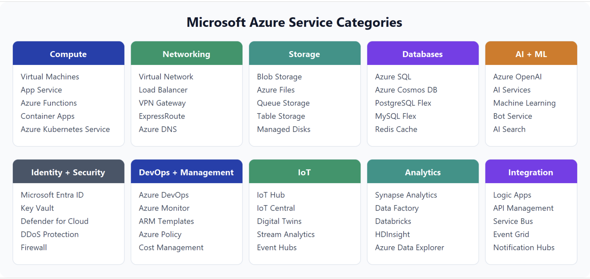

- `Azure regions, region pairs, and sovereign regions`
  - Region: one or more datacenters networked with low latency, ex: East US, West Europe
  - Region pairs:
    - most Azure regions are paired with another region within the same Geography (300 miles away)
    - example: `West US` <-> `East US`, `Switzerland North` <-> `Switzerland West`
  - Sovereign Regions - isolated from main instance of Azure
    - They have their own `independent identity systems`, `networks`, and `data centers`  
    - US DoD Central, US Gov Virginia, US Gov Arizona, etc - operated by screened U.S. personnel
    - China East, China North, etc - partnership between Microsoft and 21Vianet, Microsoft doesn't directly maintain the datacenters
- `Availability Zones`
  - Within a region, made up of one or more datacenters equipped with `independent power`, `cooling`, and `networking`
  - Each zone is an isolation boundary - if one fails, the others continue operating
  - Azure services that support AZs can be:
    - `Zonal service` - example VMs, managed disks, IP addresses
    - `Zone-redundant service` - automatically `replicates across zones` (ex: zone-redundant storage, SQL Database)
    - `Non-regional service` - always available (ex: Microsoft Entra ID, Azure DNS, Azure Traffic Manager)
- `Azure datacenters`
  - https://datacenters.microsoft.com/
  - https://datacenters.microsoft.com/globe/explore
- `Azure resources and Resource Groups`
  - anything you deploy (create/provision) in Azure is a `resource` (VMs, Virtual Network, database, etc)
  - every resource must belong to only one `resource group` - you move resources between resource groups
  - `resource groups` cannot be nested
  - deleting a `resource group` deletes all resources, actions on `resource group` apply to all resource within it 
- `Azure subscriptions`
  - when creating an Azure account you a single Azure subscription is created for you
  - you can create multiple Azure subscriptions for dev, test and prod workloads, or for different departments
  - subscriptions separate billing and access control

```bash
$  az account list-locations --output table
```

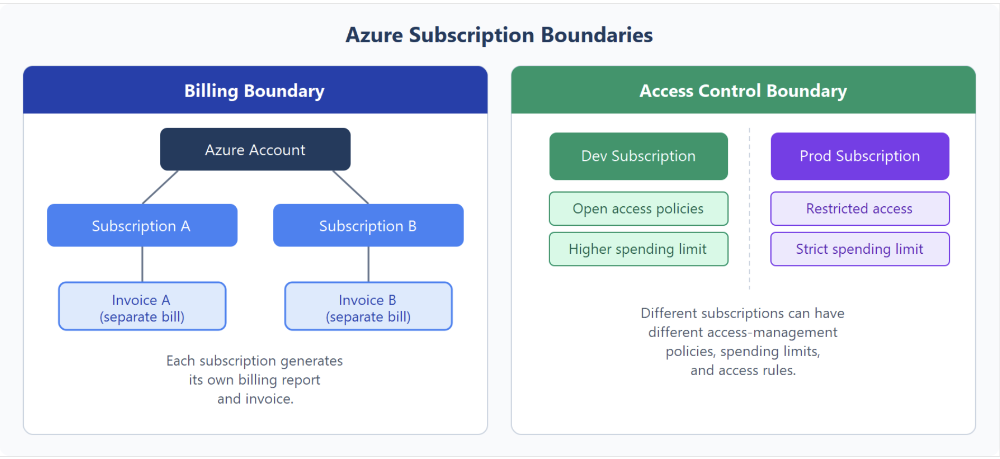
  - Azure subscription links to an Account which is an identity in Microsoft Entra ID
  - Two boundaries:
    - `Billing boundary` - how an Azure account is billed, you can create multiple subscriptions for different billing requirements
    - `Access control boundary` - dev and prd with different spending limits and access rules

- `Azure management groups`
  - Azure management groups you can organise subscriptions
  - You can use it for governance — like `access policies` or `compliance rules` - all subscriptions will inherit it
    - ex: limit VM locations to the US West Region in a Management Group called Production
      - The resource or subscription owner can't override it, which strengthens governance.
  - Can be nested up to 6 levels
  - Every `Microsoft Entra tenant` has a single top-level `Tenant Root Group`
  - A single directory supports up to 10,000 management groups.
  - Each management group and subscription can have only one parent.

- `Hierarchy of resource groups, subscriptions, and management groups`

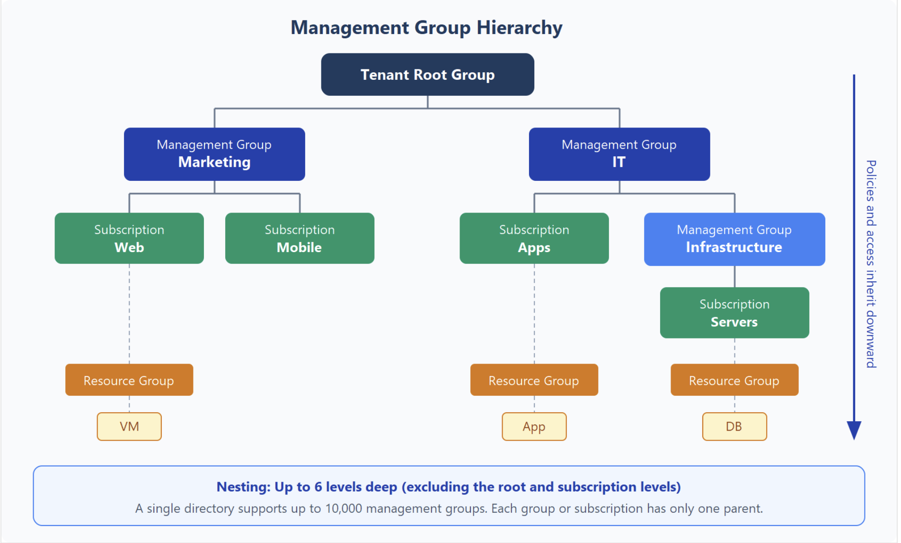

## Azure compute services

- `Azure Virtual Machines`
  - IaaS service, remove the need to buy and maintain physical server hardware 
  - Total control over the operating system (OS)
  - The ability to run custom software.
  - When you provision a VM:
    - Size - number of cores, amount of RAM
    - Storage Disks
    - Networking
  - VM family sizes:
    - B-Series: Burstable, cost-efficient - Dev/test workloads with occasional CPU spikes
    - D-series: General purpose - Web servers, small-to-medium app servers
    - E-series: Memory optimized - In-memory databases, analytics workloads
    - F-series: Compute optimized - CPU-intensive application tiers
    - M-series: Large memory footprint - Large enterprise databases
    - L-series: Storage optimized - High-throughput storage and data processing
    - N-series: GPU enabled - AI training/inference and graphics workloads 
  - Standard_D2s_v5
    - D: the VM family (general purpose in this case)
    - 2: the number of vCPUs in this size
    - s: supports Premium SSD storage - supports premium managed disks.
    - v5: hardware generation for that family
    - More in-depth explanation: https://learn.microsoft.com/en-us/azure/virtual-machines/vm-naming-conventions
  - VM Scale Sets
    - create and manage groups of identical, load-balanced VMs.
  - VM Availability Sets
    - Don't add cost, only pay for VM size 
    - They reduce the chance that all VMs are affected by one maintenance event or hardware failure.
    - Availability Sets group VMs into
      - Update domain: VMs that can be rebooted together during planned maintenance.
      - Fault domain: VMs that share a potential power or network failure point.

```bash
$ az vm list-skus --location switzerlandnorth --resource-type virtualMachines --output table
ResourceType     Locations         Name                       Zones    Restrictions
virtualMachines  SwitzerlandNorth  Standard_A1_v2             1,2,3    None
virtualMachines  SwitzerlandNorth  Standard_A2m_v2            1,2,3    None
...
virtualMachines  SwitzerlandNorth  Standard_B1s               1,2,3    None
...
```

- `Azure virtual desktop`
  - Is a managed option for remote desktop access where desktops and apps stay in the cloud instead of on local devices.
  - Azure Virtual Desktop is often easier to operate than building separate VM-based desktop environments for each user group
  - It integrates with Microsoft Entra ID for identity and access controls.
  - It supports single-session and multi-session Windows experiences, depending on user and workload needs.
  - You create `Host Pools` these pools are filled with VMs - referred as `Session Hosts`
    - can be configured:
      - `Pooled` (Multi-Session) - Multiple users share a single, powerful VM at the same time to save money
      - `Personal` (Single-Session) - Every user gets their own dedicated, private VM

- `Azure containers`
  - `Azure Container Instances` - fastest and simplest way to run a container in Azure
  - `Azure Container Apps` - next to `Azure Container Instances` include built-in load balancing and scaling
  - `Azure Kubernetes Service` - container orchestration service

- `Azure functions`
  - event-driven, serverless compute option that doesn’t require maintaining virtual machines or containers.
  - triggers like: HTTP, Timer, queue message
  - output: API response, Storage write, Event publish

- `AI, machine learning and IoT/Edge services in Azure`
  - `Azure AI services` 
    - provides prebuilt capabilities for common AI scenarios: language, speech, vision
    - useful when you want to add intelligent features through APIs instead of training your own model first
  - `Agentic AI patterns`
    - Agentic applications combine an `AI model` with `instructions`, `context`, and `tool use` to complete multistep goals
  - `Azure Machine Learning`
    - When you need to build, train, and manage custom machine learning models
  - `IoT and Edge services`
    - when your solution centers on connected devices and telemetry
    - The flow commonly starts with devices sending telemetry data through `IoT Hub` 
    then uses `cloud analytics to generate insights` and model updates that IoT Edge runtime applies near the devices.
  
      
- `Application hosting options`
  - `VMs`
  - `Containers`
  - `App Service`
    - App Service handles most of the infrastructure decisions (Endpoints can be secured, Sites can be scaled quickly, Deployment)
    - HTTP-based service for hosting 
      - `Web apps`
      - `API apps` - can build REST-based web APIs
      - `WebJobs` - run a program or a script, often used to run background tasks as part of your application logic.
      - `Mobile Apps` - build a back end for iOS and Android apps
    - support multiple languages
    - support for Windows or Linux operating system

## Azure storage services

- `Azure storage accounts`
- data that's accessible from anywhere in the world over HTTP or HTTPS, using REST APIs, SDKs, Azure CLIs, Azure Portal, Azure Storage Explorer

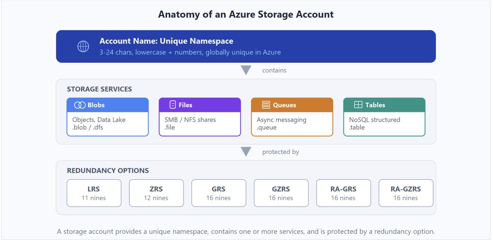

- Account Storage Types
  - `Standard general-purpose v2`
  - `Premium block blobs`
  - `Premium file shares`
  - `Premium page blobs`

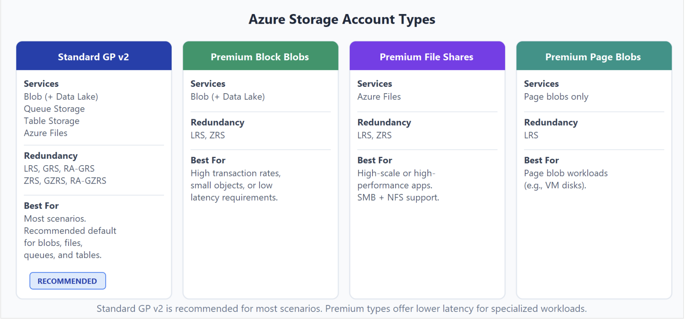

- Every storage account must have a `unique account name` within Azure.
- Name between 3 and 24 characters may contain numbers and lowercase letters

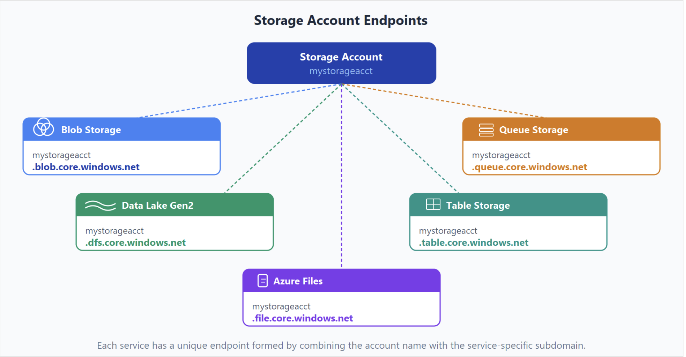

- `Azure storage redundancy`

  - `Locally redundant storage` (LRS) - replicates your data three times within a single data center in the primary region
  - `Zone-redundant storage` (ZRS) - in Availability Zone-enabled Regions, replicates storage data synchronously across three AZs
    - with ZRS data stays available for read and write operations even if one zone is unavailable.
  - `Geo-redundant storage` (GRS) - uses LRS for both regions, data is replicated asynchronously between regions
    - RPO (recovery point obojective) - interval between the last write on the primary region and last write of the secondary region
    - Azure Storage has an RPO of less than 15 minutes - although there's currently no SLA.
  - `Geo-zone redundant storage` (GZRS) - uses ZRS in primary region and LRS in secondary region
  - `RA-GRS` - same as GRS but provides read access to the secondary region
  - `RA-GZRS` - same as GZRS but provides read access to the secondary region

- `Azure storage services`
  - `Azure Blobs` 
    - object store for test and binary data, support for big data analytics through `Data Lake Storage Gen2`.
    - tiers: hot (frequently accessed), cool (30 days), cold (90 days), archive (180 days)
    - hot to archive: lower storage cost, higher access cost and retrieval latency 
  - `Azure Files` - Managed file shares for cloud or on-premises deployments.
    - fully managed file shares accessed via SMB (Server Message Block) or NFS (Network File System)
  - `Azure Queues` - messaging store for async applications
    - queues are accessed with HTTP/HTTPs, can hold millions of messages, messages up to 64 KB
  - `Azure Disks` - Block-level storage volumes for Azure VMs.
    - built on top of Azure Blob Storage (Page blobs - optimized for random read and write access)
    - is essentially a standard Hyper-V Virtual Hard Disk (.vhd) file stored as an Azure Page Blob.
  - `Azure Tables` - NoSQL table option for structured, non-relational data.

- `Azure data migration options`
  - `Azure Migrate`
    - real time migration hub to migrate on-premises data to Azure
    - single portal to start, run, and track your migration to Azure
  - `Azure Data Box`
    - One-time bulk migration of on-premises data to Azure
    - order Data Box device, after receiving connect it your network, transfer the data and return the Data Box to Microsoft
    - the entire process is tracked end-to-end by the Data Box service in the Azure portal.

- `Azure file movement options`
  - `AzCopy`
    - command line, upload and download files, copy between storage accounts, cross cloud providers
    - synchronizing blobs or files with AzCopy is one-direction synchronization, you designate the `source` and `destination`
  - `Storage Explorer` 
    - GUI app
    - uses `AzCopy` on the backend
  - `Azure File Sync`
    - works only with Windows Server 
    - [ Local User ] ──> [ Local Windows Server ] ──( Azure File Sync Agent )──> [ Azure File Share ]
                          (Local Fast Cache)                                     (Central Master Copy)

## Azure identity, access, and security

- `Azure directory services`
  - `Microsoft Entry ID`

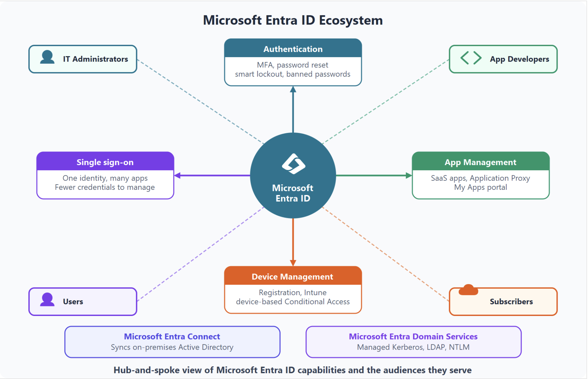
   - Microsoft Entra Connect - synchronizes in both ways user identities between on-premises Active Directory and Microsoft Entra ID 
   - Microsoft Entra Domain Services
     - domain join, group policy, LDAP, and Kerberos/NTLM authentication
     - no need to deploy or maintain domain controllers in the cloud
     - useful for legacy applications that can't use modern authentication
     - how does it work:
       - you create a `managed domain` by defining a `unique namespace` - this namespace is the domain name
       - `Two Windows Server domain controllers` are then deployed into your selected Azure region
       - This deployment of DCs is known as a replica set.
       - You don't need to manage, configure, or update these DCs.
       - The Azure platform handles the DCs as part of the managed domain, including backups and encryption at rest using Azure Disk Encryption.
     - Sync is described here:

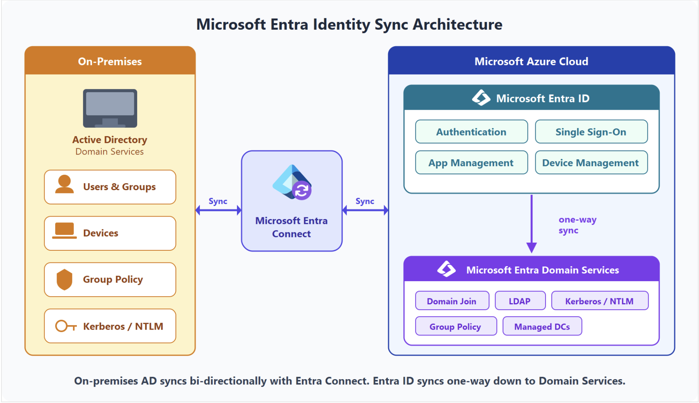

- `Azure authentication methods`
  - `Password Only`
  - `Multifactor (MFA)`
    - something the user knows - password
    - something the user has - code sent to phone
    - something the user is - biometric signal as fingerprint or face scan
  - `Passwordless`
    - `Windows Hello for Business`
    - `Microsoft Authenticator app`
    - `FIDO2 security keys`
      - built on the web authentication (WebAuthn) specification
      - FIDO2 security keys are hardware devices — typically USB, but also available with Bluetooth or NFC - that handle authentication without a username or password.
      - Users register a FIDO2 key and then select it at the sign-in screen as their primary authentication method
      - The `passkey` standard updates this model by allowing your daily devices to act as FIDO2 security keys.
    
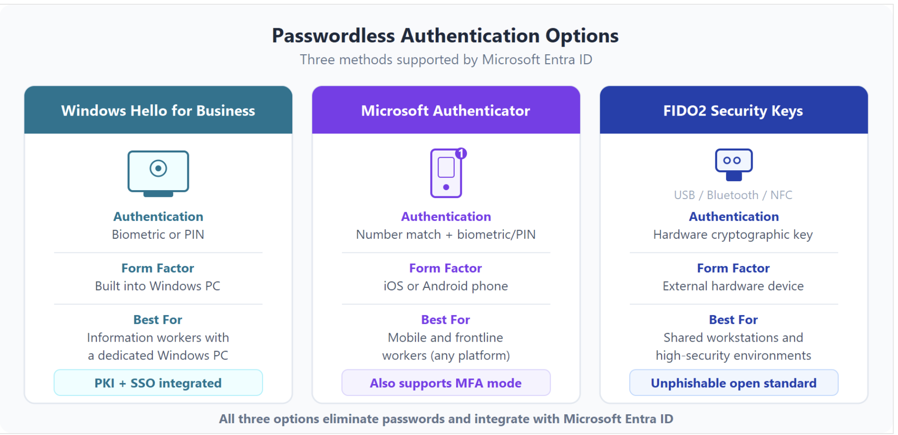

- SSO (single sign on) - lets a user sign in once and access multiple trusted applications
    
- `Azure external identities`
  - An `external identity` is a person, device, or service that exists outside your tenant.
  - The external identity provider manages authentication, and your tenant handles authorization
  - types:
    - `B2B collaboration` 
      - external partners/vendors/suppliers use their preferred identity to sign in - and appear in your tenant as guest users
    - `B2B direct connect`
      - establish a mutual, two-way trust with another Microsoft Entra tenant
      - users aren't represented in your directory, visible in Teams admin
      - currently supports Teams shared channels - across organisations
    - `External ID for customers` (formerly Azure AD B2C)
      - consumers of your published apps (can be hosted on other cloud provider as well)
      - directory is a separate External ID tenant

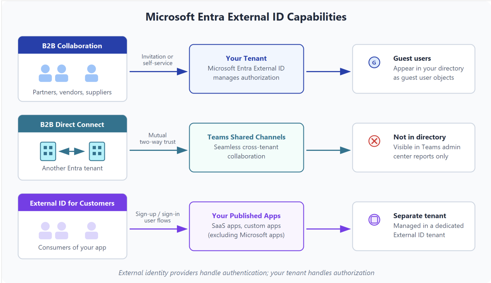

- `Azure conditional access`
  - allow (or deny) access to resources based on `identity signals` 
    - who the user is, where the user is, what device the user is requesting access from
  - scenarios:
    - could require `MFA` for administrators, or for people connecting from outside trusted network locations.
    - require users to access your application only from managed devices
    - block access from untrusted sources, such as access from unknown or unexpected locations.


- `Azure role-based access control`
  - The `principle of least privilege` says you should only grant access up to the level needed to complete a task.
  - Azure provides `built-in roles` that describe common access rules for cloud resources, you can also define your own roles
  - Each role has an associated set of `access permissions` that relate to that role
  - When you assign individuals or groups to one or more roles, they receive all the associated access permissions.
  - Role-based access control is applied to a `scope`, which is a resource or set of resources that this access applies to.
  - Azure RBAC is `hierarchical` in that when you grant access at a parent scope, those permissions are inherited by all child scopes.

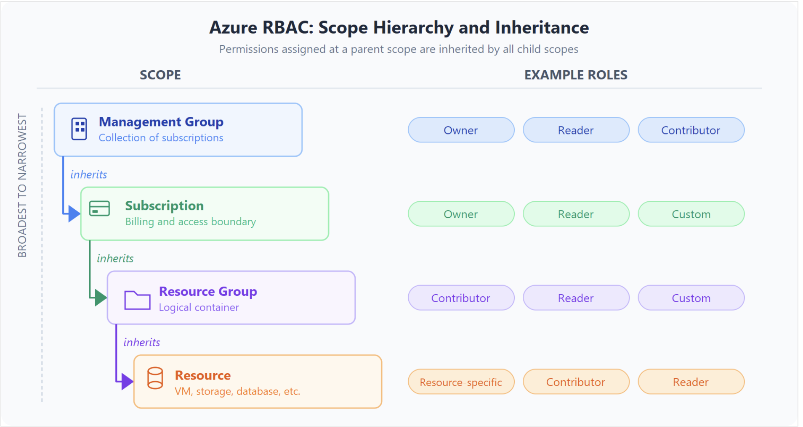

  - Azure RBAC is enforced on any action that's initiated against an Azure resource that passes through `Azure Resource Manager`.
  - Azure RBAC doesn't enforce access permissions at the application or data level - application security must be handle by the application
  - Azure RBAC uses an allow model.

- `Azure Zero Trust model`
  - Traditionally, perimeter-based networks were restricted, protected, and generally assumed safe.
  - Only managed computers could join the network, VPN access was tightly controlled, and personal devices were frequently restricted or blocked.
  - `Zero Trust` model flips that scenario, it requires everyone to authenticate
  - `Zero Trust` means access decisions are continuous and context-aware, not based only on where the request originates.
  - Guiding principles:
    - `Verify explicitly` - Always authenticate and authorize based on all available data points.
    - `Least privilege access` - limit users with Just-Enough-Access (JEA)
    - `Assume breach` - limit potential impact, verify end-to-end encryption, use analytics to get visibility
    
- `Azure defense-in-depth`
  - uses a series of mechanisms to slow the advance of an attack that aims at acquiring unauthorized access to data.

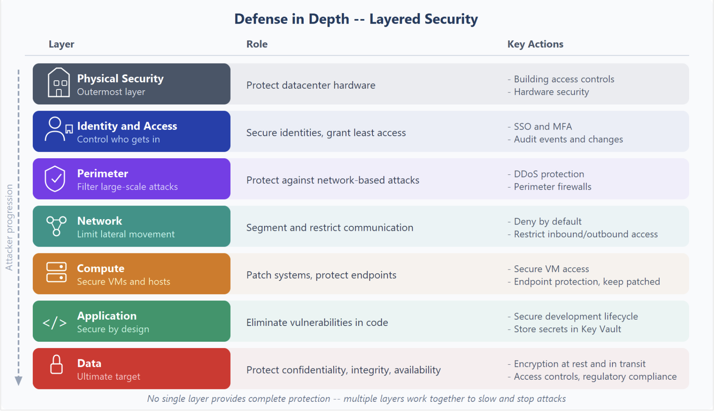

- `Encryption and key management in Azure`
 - Encryption helps protect data confidentiality by making data unreadable to unauthorized users.
 - `Encryption at rest` protects data when it is stored, such as in databases, disks, and storage accounts.
 - `Encryption in transit` protects data while it moves between services, applications, and users.
 - `Azure Key Vault` - stores secrets, controls who can access them, rotates and updates keys over time, audit secret usage
      - Secrets (such as connection strings and passwords)
      - Encryption keys
      - Certificates
 
- `Microsoft Defender for Cloud`
  - Cloud Security Posture Management (CSPM) 
  - monitors `cloud`, `on-premises`, `hybrid`, and `multicloud` resources and provides `recommendations` and `alerts` to improve `security posture`.

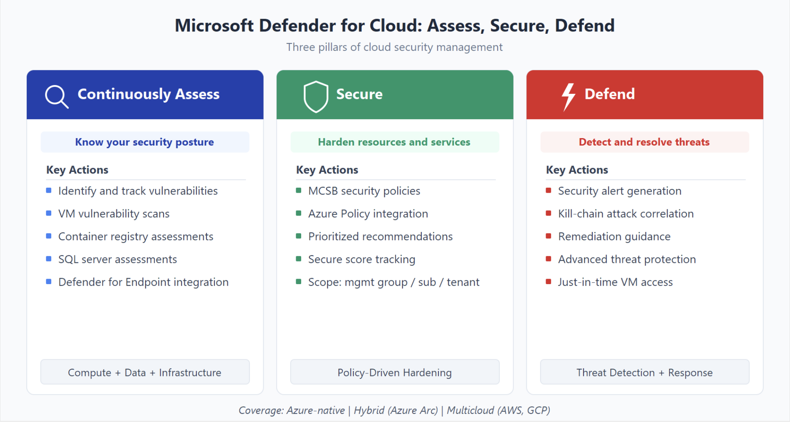

## Introduction to the Microsoft Cloud Adoption Framework

Methodologies:

- `Strategy`
- `Plan`
- `Ready`
- `Migrate`
- `Innovate`
- `Govern`
- `Manage`
- `Secure`

## Introduction to the Microsoft Azure Well-Architected Framework

The Azure Well-Architected Framework pillars:

- `Reliability`
- `Security`
- `Cost Optimization`
- `Operational Excellence`
- `Performance Efficiency`
- `Trade-offs between pillars`
