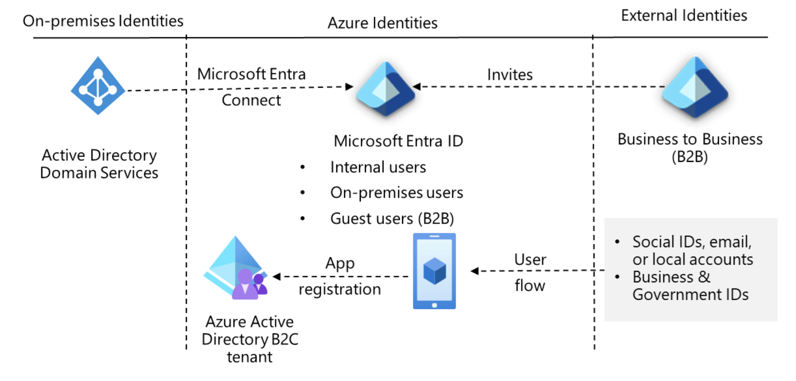
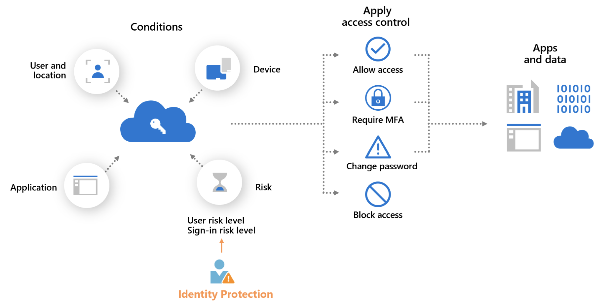

# AZ-305: Design identity, governance, and monitor solutions

## Design governance

- First create a `hierarchical structure` for your organizational environment.
- `Tenant root group`
  - `management groups` - 
    - `subscriptions` - billing boundaries
      - `resource groups` 
        - `resources`
- The structure enables to apply governance strategies (`Azure policies` / `resource tags`) where they are needed

- `Management Groups`
  - can be nested up to 6 levels (not including the tenant group or the subscription level)
  - Keep the management group hierarchy reasonably flat
  - consider: 
    - geographical structure
    - organizational or departmental structure
    - production management group
    - sensitive information with separate management group

- `Subscriptions` - separate billing
  - development, test, and production
  - HR / Legal / R&D
  - example: dedicated shared services subscription
    - shared services subscriptions include `Azure ExpressRoute` and `Virtual WAN`.

- `Resource groups`
  - have their own location (region) assigned, this is where metadata is stored
  - resources in the resource group can be in different regions.
  - a resource in resource group can connect to resources in another resource group
  - resources can be moved between resource groups with some exceptions, each resource must be one, and only one resource group
  - resource groups can't be nested / can't be renamed

-`Resource Tags`
  - name/value pair, ex: env = production or env = dev, test.
  - You can assign one or more tags to each `Azure resource`, `resource group`, or `subscription` - not to management groups
  - Resource tags are not inherited
  - Consider using `Azure policy` to apply tags and enforce tagging rules and conventions.

- `Azure Policy`
  - Azure policies are `inherited` down the hierarchy - on all 4 levels
  - There are built-in policies https://learn.microsoft.com/en-us/azure/governance/policy/samples/built-in-policies
  - Groups of related policies called `initiatives`
  - List of built-in initiatives https://learn.microsoft.com/en-us/azure/governance/policy/samples/built-in-initiatives
  - examples: 
    - VMs limited to certain SKUs
    - Enforce product tag and value
    - Only deploy to certain locations
  - `Azure Policy compliance dashboard` 
  - Consider how to handle a noncompliant resource
    - Deny changes to the resource.
    - Log changes to the resource.
    - Alter the resource before or after the change.
  - `Azure Policy` vs `Azure RBAC` 
    - with `Azure Policy` doesn't depend on who made the change, it only evaluates the state of resource and acts to ensure the resource stays compliant.
    - with `Azure RBAC` it matters who makes the change, what they can do with the resource
    - If a user has access to complete an action based on `Azure RBAC` but the result is a noncompliant resource, `Azure Policy` still blocks the action.

- `Azure RBAC`
  - `Who`(Identity) / `What`(Role (Built-in/Custom)) / `Where` (Scope: Tenant/Managemnt Group/Subscription/Resource Group/Resource)
  - Role - group of permissions
    - Owner - for admins
    - Contributor - read write access
    - Reader - for observers, auditors, reviewers
  - Custom roles - grant precise level of access
  - Assign: an `Identity` to `Role` within a `Scope`
    - Azure RBAC is an `additive model` - effective permissions are the `sum of your role assignments`.
    
- `Azure landing zones` - https://learn.microsoft.com/en-us/azure/cloud-adoption-framework/ready/landing-zone/?tabs=hubspoke
  - infrastructure environment for hosting your workloads, management groups, subscriptions
  - platform landing zone
  - application landing zone
  - Landing zones are pre-provisioned through code. (Bicep or Terraform)
  - `Azure landing zone accelerator` - template

## Design authentication and authorization solutions

- `Identity and Access Management. (IAM)`
  - Unified identity management - Manage all your identities and access to apps in a central location
  - Seamless user experience - fast sign-in experience
  - Secure adaptive access - risk-based adaptive access policies without compromising the user experience 

- `Microsoft Entra ID`- https://learn.microsoft.com/en-us/entra/identity/
  - is a hybrid identity solution
  - with `Microsoft Entra Connect` you can bring on-premises identities into Microsoft Entra ID
  - consider using a `single Microsoft Entra instance`
  - consider phishing-resistant authentication methods like passkeys - origin-bound public-key cryptography and satisfy MFA in a single step. 
  - consider using SSO
  - consider overhead of managing separate identities

- `Microsoft Entra business-to-business (Microsoft Entra B2B)`
  - the external partner uses their own identity management solution
  - your partner users are invited as guest users.

- `Azure Active Directory B2C (business-to-customer)` - Microsoft Entra External ID
  - managing customer identities and their access to your apps
  - requires a new Microsoft Entra tenant

- `Conditional Access` 
  - tool that Microsoft Entra ID uses to allow (or deny) access to resource based on `signals`
  - you need a Microsoft Entra ID P1 or P2 license
  - if you have a Microsoft 365 Business Premium license, you also have access to Conditional Access features.

- `Privileged Identity Management`
  - Just-In-Time access 
  - ex: you request to be an admin for 2 hours
  - Activates a temporary, time-bound role assignment after you provide a business justification.

- `Identity protection`
  - provides `risk policy detection` - any identified suspicious actions
    - user risk - probability that a given identity or account is compromised
    - sign-in risk - probability that a given sign-in isn't authorized by the identity owner.
  - below workflow: 
    - administrator first configures the risk policies that then monitor for identity risks.
    - when risk is detected the policies enforce measures to remediate it.
    - A policy might, for example, prompt a user to reset their password in response to a risk detected.
    - The user then resets their password, and the risk is remediated.

- `Access Reviews`
  - is a planned review of the access needs, rights, and history of user access.

- `Service principals for applications`
  - it acts as a dedicated application account that can authenticate without human intervention.
  - authenticates using one of two methods:
    - Client Secret
    - Certificates

- `Managed identities`
  - The "Secret-Less" Service Principal
  - Microsoft recommends avoiding traditional Service Principals in favor of `Managed Identities`
  - A managed identity is a service principal wrapped in a protective layer managed entirely by Azure
  - If your code runs inside Azure (Azure VM / Azure Function) you can turn on Managed Identity
  - Azure will automatically handle creating the Service Principal, authenticating it, and rotating the credentials behind the scenes.
  - 

- `Azure Key Vault`

## Design a solution to log and monitor Azure resources

- `Azure Monitor data sources`

- `Azure Monitor Logs (Log Analytics) workspaces`

- `Azure Workbooks and Azure Insights`

- `Azure Data Explorer`
